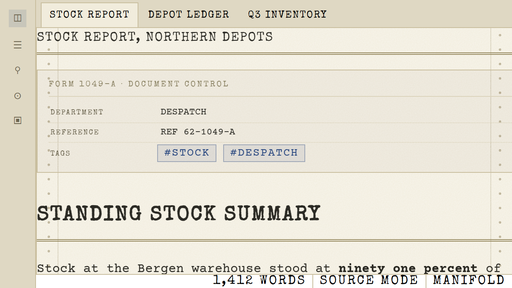
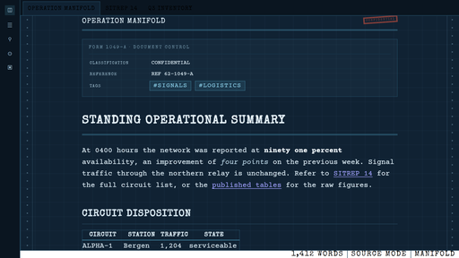

# Manifold

A typewritten document theme for Obsidian. Machine-written paperwork: continuous
form manifold paper with tractor-feed edges, carbon copy ink, stencil section
labels, and fan-fold green-bar banding.

The part worth having is the redaction. Selecting a passage lays a bar over it and
knocks the glyphs out, and a passage marked as `<mark class="redacted">` stays
blacked out in reading view and in print. The companion plugin places that mark
from the editor, with a hotkey or the right-click menu.





Two sheets:

- **Light, MANIFOLD.** Aged cream manifold paper, black typewriter ribbon, carbon
  copy blue for links and accents. Fan-fold green-bar banding on tables and code.
- **Dark, CYANOTYPE.** The same document reproduced as an engineering blueprint.
  Prussian blue sheet, weak cyan draughtsman's grid, chalk white type, chart cyan
  accents.

## Install

From Obsidian: open Settings, Appearance, Themes, select Manage, search for
Manifold, then Install and use.

By hand: copy the `Manifold` folder into `<vault>/.obsidian/themes/`, then
choose it in Settings, Appearance, Themes. A restart is not required.

The four Courier Prime faces and the one Special Elite face are embedded in
`theme.css` as WOFF2, so the theme is a single file that makes no network call at
all. That is what the community directory requires, and it matters because an
install fetches `theme.css` and `manifest.json` and nothing else, so a reference
to a separate font file would break on every machine but this one.

## What is in it

Paper and ink

- Tractor-feed perforations down both edges of the sheet, with the margin rule a
  continuous form printer leaves behind.
- Paper grain in light mode, a 32 px draughtsman's grid in dark mode.
- Ink bleed: a fraction of a pixel of offset on body text, so the ribbon reads as
  pressed onto paper rather than rendered by a screen.

Typography

- Courier Prime everywhere, including the interface, so the whole machine reads
  as one typewriter.
- Emphasis is a second strike on the same face rather than a heavier font, so a
  bold word stays the same typewriter. See Bold below.
- Special Elite for headings and labels. H1 and H2 are separated by rules, not by
  size alone. H4 through H6 are small boxed labels, the sort printed on a form.

Document furniture

- A rubber stamp beside the note title, off by default. Set
  `--manifold-choice-stamp-display` to `block` to print one.
- Selecting text lays a bar over it and sets the words in the colour of the sheet,
  so the bar reads as a marker struck through the passage rather than a blackout.
  Set `--manifold-choice-selection-ink` to `transparent` to knock the glyphs out
  instead, the way a reviewing officer blacks a line out. Nothing on disk changes
  either way.
- A passage can also be redacted for good, so the bar stays after the selection
  is gone. That needs the companion plugin, see below.
- The properties block is styled as a document control form, headed FORM 1049-A.
- A dashed cut line for horizontal rules, and a closing line at the end of every
  document in reading view.

Structure

- Green-bar banding on alternating table rows and, one band per line, inside code
  blocks.
- Checkboxes are square form boxes with a typewritten X, not a rounded tick.
- Callouts are stamped dockets: square, outlined in the signal colour, title set
  in the stencil face with a rule under it. Callout icons are removed.
- Tags are uppercase bordered reference labels.
- Every radius in the application is 0. Menus, modals, tabs, toggles, scrollbars
  and buttons are square and hairline ruled.
- Period callout palette only: cobalt, teal, olive, amber, signal red, graphite.
- A print stylesheet, so the document prints as paper rather than as a screen.
- Excalidraw's interface is squared off and set in Courier Prime, see Excalidraw below.

## Bold

Courier Prime ships a light Regular and a very heavy Bold, and the jump between
them is close to double the ink. A bold word set in the real Bold therefore reads
as a different typewriter rather than the same one struck twice, which is the
report this section answers. The theme keeps a single weight in the text family
and draws emphasis with a light stroke on the letterforms already in use, which
measures a third more ink rather than nearly double, and cannot change the face
because it is the same face.

Tune it with `--manifold-choice-bold-stroke` in the Manifold panel, or in a
snippet. 0.5px is close to a hard strike, 0.7px is close to the real Bold, and
the real face remains available as `Courier Prime Heavy` for anyone who wants it.

## Excalidraw

The Excalidraw plugin draws its own interface, and it derives the interface colours
from the drawing's canvas colour, so a manifold sheet tints its chrome by itself.
What it has no setting for is shape and type, so the theme supplies those: panels,
buttons and inputs are square, the soft island shadow becomes a hard paper edge,
and the whole interface is set in Courier Prime to match Obsidian's own chrome.

The canvas colour is a property of each drawing rather than of the theme, so no
theme can set it. In the plugin, put the colour you want into a template drawing
and point Settings, Excalidraw, "Excalidraw template file or folder" at it. New
drawings then start on that colour, with the ink, the line weight and the default
text font taken from the same template. For Courier Prime in a drawing, add the
font file to your vault and point the plugin's local font option at it, since
Excalidraw's own font list does not include it.

## Redacting a passage for good

The theme draws a permanent bar for any passage marked as
`<mark class="redacted">words</mark>`. Typing that by hand works, but the
companion plugin does it for you:

- Right-click a selection and choose Redact selection.
- Or bind a hotkey to "Manifold Redaction: Toggle redaction on the selection".
- Run it again on the same passage to lift the bar. Select the whole thing, or
  just put the cursor inside it, and run it once more.

The plugin has its own repository,
https://github.com/VibeCoderToolkit/obsidian-manifold-redact, and installing it
is a folder copy. Existing redactions keep rendering without it, because the bar
is theme CSS.

In the editor the line you are working on lifts its overlay so the passage can be
read and edited, and the bar closes again when you move the cursor away. In
reading view and in print the bar stays shut.

Honest limitation: this is a document marking, not encryption. The words stay in
the file as plain text, so search, sync, export and anyone who opens the note
will still see them. If a passage genuinely must not be read, delete it.

There are two bars, and they are separate on purpose.

`--manifold-choice-selection-ink` is the bar you get while selecting text. It
defaults to the colour of the sheet, so the words read as a marker struck
through the passage, and it follows light and dark on its own, cream on the black
bar and blueprint blue on the chalk one. Set it to `transparent` to knock the
glyphs out instead. The snippet in `snippets/stamped-redactions.css` sets the same
value, so with this default it is no longer needed.

`--manifold-choice-mark-ink` is the bar carried by a passage actually written as
redacted, which is what the Redaction plugin produces. It hides its words by
default and deliberately does not follow the selection setting, so a marker look
while selecting cannot leak into a redaction. Set that one too if you want those
shown as well, and remember that nothing is concealed either way: the words are
plain text in the file, and a passage that must not be read has to be deleted.

## Tuning

The theme exposes its knobs as CSS variables on `body`. Set them in a CSS
snippet (Settings, Appearance, CSS snippets) inside a `body { }` rule, or install
the community plugin Style Settings and use the Manifold panel, which is already
declared in the theme.

| Variable | Default | Meaning |
| --- | --- | --- |
| `--manifold-choice-paper` | `#f1ecdc` | Sheet colour for light mode |
| `--manifold-choice-ink` | `#2b2a24` | Ribbon colour |
| `--manifold-choice-accent` | `#27467f` | Accent, carbon blue in light, cyan in dark |
| `--manifold-choice-perforation` | `#b0a483` | Tractor-feed hole ink |
| `--manifold-choice-redaction` | `#000000` | Bar laid over selected text. Black on the cream sheet, the ink colour on the blueprint. |
| `--manifold-choice-selection-ink` | `var(--manifold-paper)` | Colour of the words under the bar while selecting. The default reads as a marker, `transparent` hides them. |
| `--manifold-choice-mark-ink` | `transparent` | Colour of the words under a written redaction. Kept separate from the selection on purpose. |
| `--manifold-choice-bold-stroke` | `0.35px` | How hard a bold passage is struck. 0.5px is a hard hit, 0.7px approaches the real Bold face, 0 removes the emphasis. |
| `--manifold-choice-greenbar-alpha` | `0.3` | Green-bar strength, 0 disables |
| `--manifold-choice-ink-bleed` | `0.25` | Ink weight on the paper, 0 for a new ribbon |
| `--manifold-choice-stamp-display` | `none` | `block` prints the rubber stamp beside the title |
| `--manifold-choice-stamp-text` | `"CONFIDENTIAL"` | Stamp wording, used only when the stamp is shown |
| `--manifold-choice-footer-text` | `"END OF DOCUMENT"` line | Closing line, quotes included |

The Style Settings values are read through a fallback, so an override applies in
both light and dark mode. If you want light and dark to differ, set
`--manifold-paper` and `--manifold-ink` directly inside a
`.theme-light { }` and `.theme-dark { }` snippet instead.

To start from a different stock entirely, copy the theme folder and edit the
TUNABLE block at the top of `.theme-light` in `theme.css`.

## Files

```
Manifold/
  manifest.json
  theme.css            the whole theme
  fonts/               the original TTF faces and both licence texts. The faces
                       themselves are embedded in theme.css, see above
  images/              screenshots, 512x288 for the directory and 1200x800 for the listing
  _preview/            a standalone HTML harness, useful for design changes
  snippets/            ready-made CSS snippets, see stamped redactions above
```

`_preview/preview.html` renders the same markup Obsidian produces for a reading
view, so a change to `theme.css` can be judged in a browser without switching
themes. Because the faces are embedded, it opens straight from disk, with no
server and with the `fonts/` folder deleted. Delete the folder if you do not want
it.

## Licence

The theme CSS is MIT, see LICENSE. Courier Prime is (c) Quote-Unquote Apps, SIL
Open Font License 1.1. Special Elite is (c) Astigmatic, Brian J. Bonislawsky,
Apache License 2.0. Both licence texts ship in `fonts/`.
